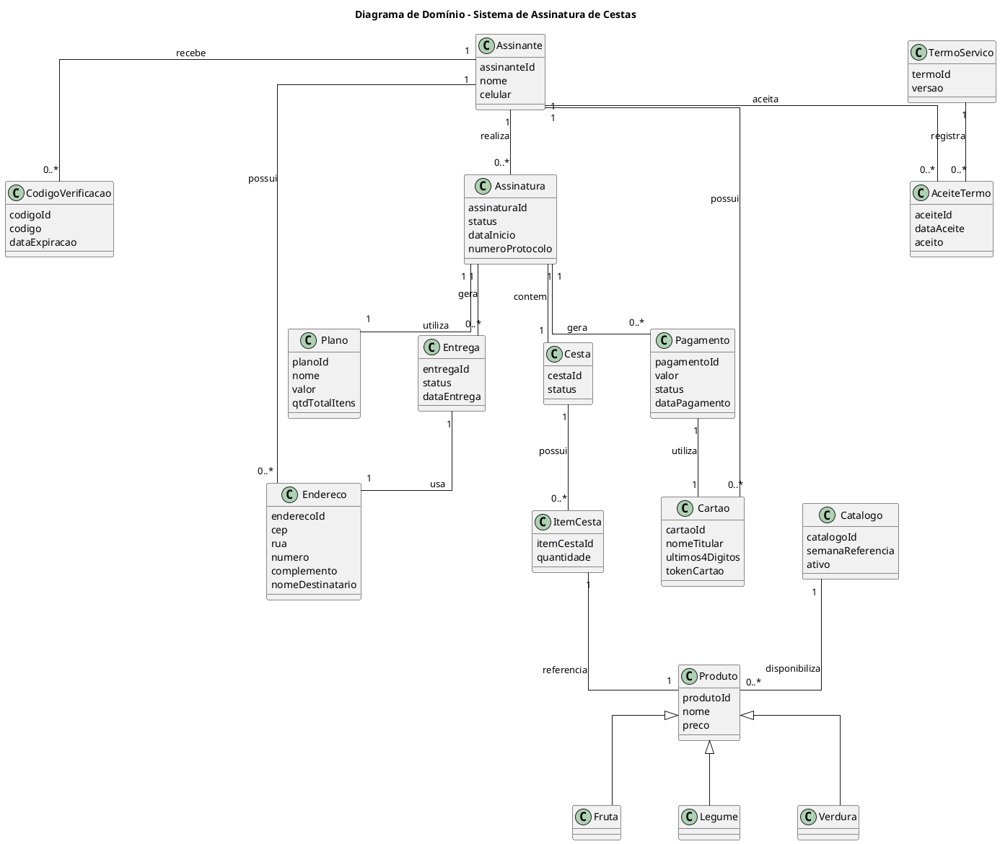
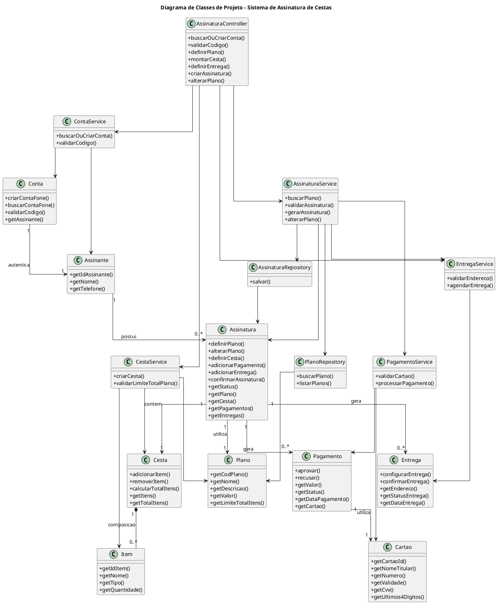
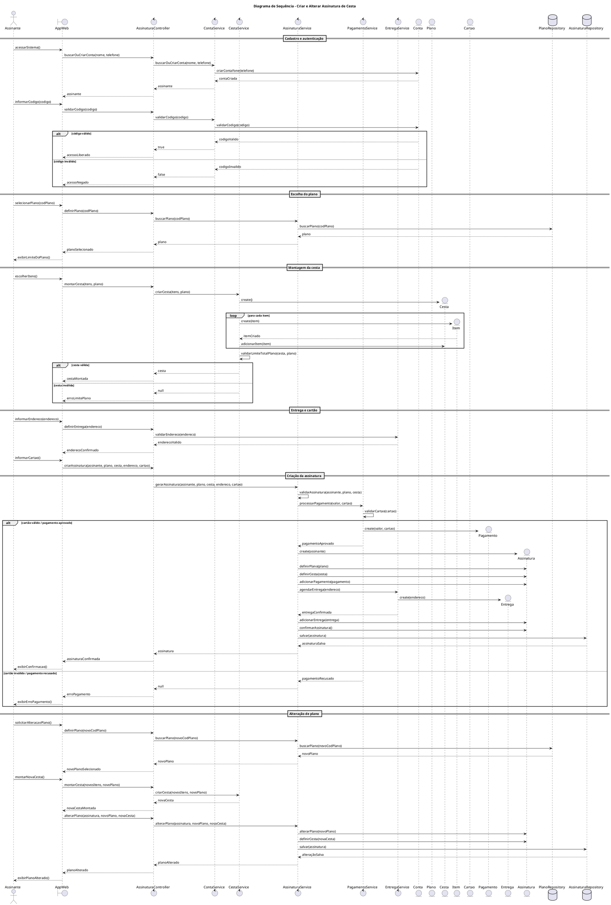

# iFruit

## 1. Descrição do Projeto

Este projeto implementa, em Java, o fluxo principal de um sistema de assinatura mensal de cestas de frutas, legumes e verduras.

O sistema foi desenvolvido com base nos diagramas UML elaborados durante as etapas de análise e projeto, principalmente:

- Diagrama de Domínio;
- Diagrama de Classes de Projeto;
- Diagrama de Sequência.

O objetivo é transformar o modelo dinâmico representado no Diagrama de Sequência em uma implementação prática em Java, mantendo correspondência entre os modelos UML e o código-fonte.

O sistema permite que um assinante realize o cadastro/autenticação, escolha um plano mensal, monte uma cesta respeitando o limite total de itens do plano, informe endereço de entrega, cadastre cartão de crédito, confirme a assinatura e tenha seus dados persistidos em arquivo `.txt`.

---

## 2. Objetivo da Atividade

O objetivo desta atividade é implementar o cenário principal do caso de uso desenvolvido pelo grupo, utilizando Java e respeitando a separação entre:

- Objetos de fronteira;
- Controller;
- Entidades de domínio;
- Services;
- Repositories;
- Persistência em arquivo.

A implementação deve corresponder aos modelos de projeto criados durante as fases de análise e design.

---

## 3. Caso de Uso Principal

### Nome do Caso de Uso

Criar Assinatura de Cesta

### Ator Principal

Assinante

### Descrição

O assinante acessa o sistema, informa seus dados, valida o acesso por código, escolhe um plano mensal, monta sua cesta, informa endereço de entrega, cadastra cartão de crédito e confirma a assinatura.

---

## 4. Fluxo Principal do Caso de Uso

1. O assinante acessa o sistema.
2. O sistema solicita nome e telefone.
3. O sistema cria ou localiza a conta do assinante.
4. O sistema envia um código de verificação.
5. O assinante informa o código recebido.
6. O sistema valida o código.
7. O sistema exibe os planos mensais disponíveis.
8. O assinante escolhe um plano.
9. O sistema exibe o limite total de itens permitido no plano.
10. O assinante monta a cesta.
11. O sistema valida se a cesta respeita o limite total do plano.
12. O assinante informa o endereço de entrega.
13. O assinante informa os dados do cartão de crédito.
14. O sistema valida os dados do cartão.
15. O sistema processa o pagamento.
16. O sistema confirma a assinatura.
17. O sistema salva os dados da assinatura em arquivo `.txt`.
18. O sistema permite alterar o plano após a assinatura criada.

---

## 5. Regras de Negócio

### 5.1 Planos Mensais

O sistema possui três planos mensais:

| Código | Plano | Valor | Limite da Cesta |
|---|---:|---:|---:|
| 1 | Mensal Básico | R$ 79,90 | até 7 itens |
| 2 | Mensal Família | R$ 129,90 | até 13 itens |
| 3 | Mensal Premium | R$ 189,90 | até 20 itens |

---

### 5.2 Limite da Cesta

Cada plano define apenas o **total máximo de itens da cesta**.

O sistema não limita a quantidade por categoria.

Ou seja, o assinante pode distribuir o total entre frutas, legumes e verduras como quiser.

Exemplo para o plano de 7 itens:

```text
7 bananas
ou
3 bananas + 2 maçãs + 2 cenouras
ou
4 tomates + 3 alfaces
```

O importante é que o total não ultrapasse o limite do plano.

---

### 5.3 Remoção de Itens

Durante a montagem da cesta, o assinante pode:

```text
Adicionar itens
Visualizar a cesta
Remover itens
Finalizar a cesta
```

Quando um item é removido, o sistema recalcula automaticamente o total de itens da cesta.

---

### 5.4 Pagamento

O pagamento é realizado somente por cartão de crédito, pois o sistema representa uma assinatura mensal.

A validação do cartão verifica:

- nome do titular preenchido;
- número do cartão contendo apenas dígitos;
- número do cartão com tamanho entre 13 e 19 dígitos;
- validade no formato `MM/AA`;
- mês válido entre 01 e 12;
- cartão não vencido;
- CVV com 3 ou 4 dígitos.

Exemplo de cartão para teste:

```text
Nome do titular: Joao Silva
Numero do cartao: 4111111111111111
Validade MM/AA: 12/30
CVV: 123
```

---

### 5.5 Alteração de Plano

Após a assinatura ser confirmada, o sistema permite que o assinante altere o plano.

Ao alterar o plano:

1. O assinante escolhe um novo plano;
2. O sistema exibe o novo limite total da cesta;
3. O assinante monta uma nova cesta;
4. O sistema valida a nova cesta;
5. O sistema salva a alteração no arquivo de persistência.

---

## 6. Arquitetura Utilizada

O projeto segue uma organização baseada no padrão MVC, com camadas auxiliares de `service` e `repository`.

```text
View → Controller → Service → Model / Repository
```

### View

Responsável pela interação com o usuário.

Arquivo:

```text
AppWeb.java
```

Apesar do nome `AppWeb`, a interface utilizada é via terminal, com `Scanner`.

---

### Controller

Responsável por receber as ações da View e coordenar o fluxo do sistema.

Arquivo:

```text
AssinaturaController.java
```

---

### Model

Representa as entidades do domínio do sistema.

Classes:

```text
Assinante
Conta
Plano
Item
Cesta
Cartao
Pagamento
Entrega
Assinatura
```

---

### Service

Contém as regras de negócio do sistema.

Classes:

```text
ContaService
CestaService
AssinaturaService
PagamentoService
EntregaService
```

---

### Repository

Responsável por buscar e salvar dados.

Classes:

```text
PlanoRepository
AssinaturaRepository
```

---

## 7. Estrutura do Projeto

```text
ProjetoAssinaturaCestas/
├── src/
│   ├── Main.java
│   ├── controller/
│   │   └── AssinaturaController.java
│   ├── view/
│   │   └── AppWeb.java
│   ├── model/
│   │   ├── Assinante.java
│   │   ├── Conta.java
│   │   ├── Plano.java
│   │   ├── Item.java
│   │   ├── Cesta.java
│   │   ├── Cartao.java
│   │   ├── Pagamento.java
│   │   ├── Entrega.java
│   │   └── Assinatura.java
│   ├── service/
│   │   ├── ContaService.java
│   │   ├── CestaService.java
│   │   ├── AssinaturaService.java
│   │   ├── PagamentoService.java
│   │   └── EntregaService.java
│   └── repository/
│       ├── PlanoRepository.java
│       └── AssinaturaRepository.java
├── assinaturas.txt
└── README.md
```

O arquivo `assinaturas.txt` é criado automaticamente na raiz do projeto quando uma assinatura é confirmada.

---

## 8. Diagrama de Domínio

O Diagrama de Domínio representa os principais conceitos do negócio.



---

## 9. Diagrama de Classes de Projeto

O Diagrama de Classes de Projeto representa a estrutura implementada em Java.

Este diagrama mostra principalmente métodos, seguindo o padrão adotado no projeto.



---

## 10. Diagrama de Sequência

O Diagrama de Sequência representa o comportamento dinâmico do sistema durante a criação da assinatura.



---

## 11. Correspondência Entre UML e Código

| Elemento UML | Classe Java |
|---|---|
| Assinante | `model/Assinante.java` |
| Conta | `model/Conta.java` |
| Plano | `model/Plano.java` |
| Cesta | `model/Cesta.java` |
| Item | `model/Item.java` |
| Cartao | `model/Cartao.java` |
| Pagamento | `model/Pagamento.java` |
| Entrega | `model/Entrega.java` |
| Assinatura | `model/Assinatura.java` |
| AppWeb | `view/AppWeb.java` |
| AssinaturaController | `controller/AssinaturaController.java` |
| ContaService | `service/ContaService.java` |
| CestaService | `service/CestaService.java` |
| AssinaturaService | `service/AssinaturaService.java` |
| PagamentoService | `service/PagamentoService.java` |
| EntregaService | `service/EntregaService.java` |
| PlanoRepository | `repository/PlanoRepository.java` |
| AssinaturaRepository | `repository/AssinaturaRepository.java` |

---

## 12. Persistência

A persistência foi feita com arquivo `.txt`.

Arquivo:

```text
assinaturas.txt
```

A classe responsável por salvar os dados é:

```text
AssinaturaRepository.java
```

Os dados salvos incluem:

- ID da assinatura;
- status;
- data de criação;
- nome do assinante;
- telefone;
- plano escolhido;
- valor mensal;
- limite total da cesta;
- itens escolhidos;
- pagamento;
- cartão usado;
- entrega.

---

## 13. Exemplo de Conteúdo do Arquivo `assinaturas.txt`

```text
====================================
ID Assinatura: 1
Status: CONFIRMADA
Data Criacao: 2026-05-14
Assinante: Joao Silva
Telefone: 11999999999
Plano: Mensal Basico
Valor Plano: R$ 79.9
Limite Total da Cesta: 7
Total de Itens Escolhidos: 7
Itens da Cesta:
- Banana | Tipo: Fruta | Quantidade: 3
- Maca | Tipo: Fruta | Quantidade: 2
- Cenoura | Tipo: Legume | Quantidade: 2
Pagamentos:
- Cartao final: 1111 | Valor: R$ 79.9 | Status: APROVADO | Data: 2026-05-14
Entregas:
- Endereco: Rua das Flores, 123 - Centro - Sao Paulo/SP | Data: 2026-05-16 | Status: CONFIRMADA
====================================
```

---

## 14. Como Compilar e Executar

### Linux, macOS ou Git Bash

Na raiz do projeto:

```bash
javac -d out $(find src -name "*.java")
```

Depois execute:

```bash
java -cp out Main
```

---

### Windows PowerShell

Na raiz do projeto:

```powershell
Get-ChildItem -Recurse src/*.java | ForEach-Object { $_.FullName } > sources.txt
javac -d out @sources.txt
java -cp out Main
```

---

## 15. Exemplo de Execução

```text
=======================================
   SISTEMA DE ASSINATURA DE CESTAS
=======================================

=== Cadastro e Autenticacao ===

Exemplo de preenchimento:
Nome: Joao Silva
Telefone: 11999999999

Digite seu nome: Joao Silva
Digite seu telefone: 11999999999

Conta localizada/criada com sucesso.
Codigo enviado para o telefone informado.
Codigo de teste: 1234

Digite o codigo recebido: 1234

Acesso liberado!
```

---

## 16. Menu da Cesta

Durante a montagem da cesta, o sistema exibe:

```text
Menu da cesta:
1 - Adicionar Banana  | Fruta
2 - Adicionar Maca    | Fruta
3 - Adicionar Alface  | Verdura
4 - Adicionar Tomate  | Legume
5 - Adicionar Cenoura | Legume
6 - Visualizar cesta
7 - Remover item da cesta
0 - Finalizar cesta
```

O usuário pode adicionar, visualizar ou remover itens antes de finalizar.

---

## 17. Exemplo de Dados do Cartão

```text
Nome do titular: Joao Silva
Numero do cartao: 4111111111111111
Validade MM/AA: 12/30
CVV: 123
```

---

## 18. Tratamento de Validações

O sistema realiza validações em diferentes pontos.

### Validação da Conta

A conta é validada por meio de código de verificação.

Código de teste:

```text
1234
```

---

### Validação da Cesta

A cesta é validada com base no limite total do plano.

Exemplo:

```text
Plano Mensal Básico: até 7 itens
```

Se o usuário tentar ultrapassar esse limite, o sistema bloqueia a adição.

---

### Validação do Cartão

O cartão é validado em `PagamentoService`.

O sistema verifica:

```text
Nome preenchido
Número com 13 a 19 dígitos
Validade no formato MM/AA
Mês válido
Cartão não vencido
CVV com 3 ou 4 dígitos
```

---

## 19. Tecnologias Utilizadas

- Java;
- Programação Orientada a Objetos;
- MVC;
- UML;
- Persistência em arquivo `.txt`;
- GitHub;
- GitHub Wiki.

---

## 20. Roteiro Sugerido para o Vídeo

Para o vídeo de explicação, recomenda-se seguir esta ordem:

1. Apresentar o objetivo do sistema;
2. Mostrar o Diagrama de Domínio;
3. Explicar as principais entidades;
4. Mostrar o Diagrama de Classes de Projeto;
5. Explicar a arquitetura MVC;
6. Mostrar o Diagrama de Sequência;
7. Explicar o fluxo principal;
8. Mostrar o código-fonte organizado em pastas;
9. Executar o sistema pelo terminal;
10. Criar uma assinatura completa;
11. Mostrar a validação da cesta;
12. Mostrar a validação do cartão;
13. Mostrar a alteração de plano;
14. Mostrar o arquivo `assinaturas.txt` gerado;
15. Concluir explicando a correspondência entre UML e código.

---

## 21. Considerações Finais

O projeto implementa o fluxo principal do caso de uso de criação de assinatura de cestas, respeitando os diagramas UML desenvolvidos na fase de análise e projeto.

A implementação utiliza Java com organização MVC, separando responsabilidades entre View, Controller, Model, Services e Repositories.

A persistência foi realizada em arquivo `.txt`, atendendo ao requisito da atividade.

O sistema permite criar assinatura, validar cesta, processar pagamento por cartão, salvar os dados e alterar o plano posteriormente.
=======
Link entrega 1 (youtube) = https://youtu.be/OTf_xURELyk
>>>>>>> afa93b23703f3dec49acda813d97bc01a1edd939
